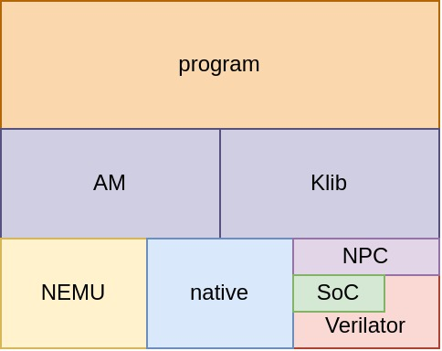
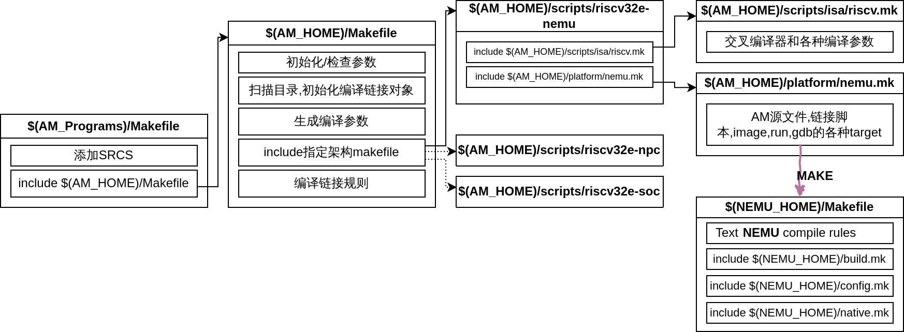
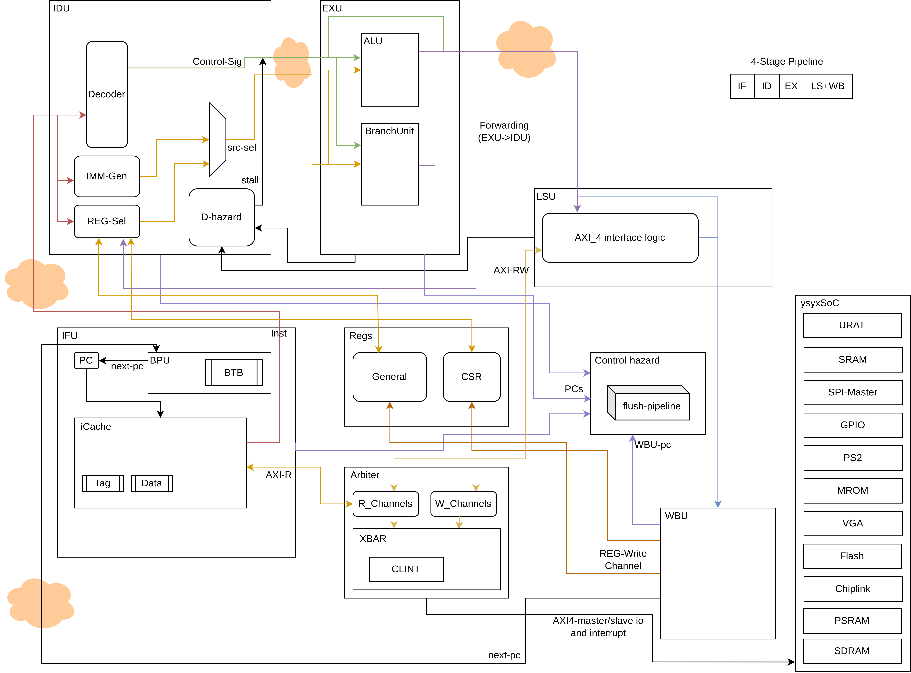
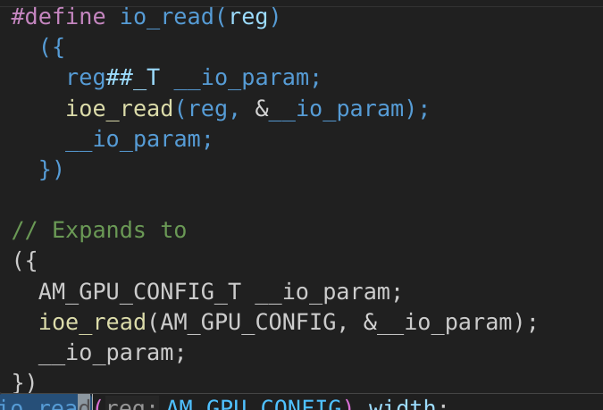
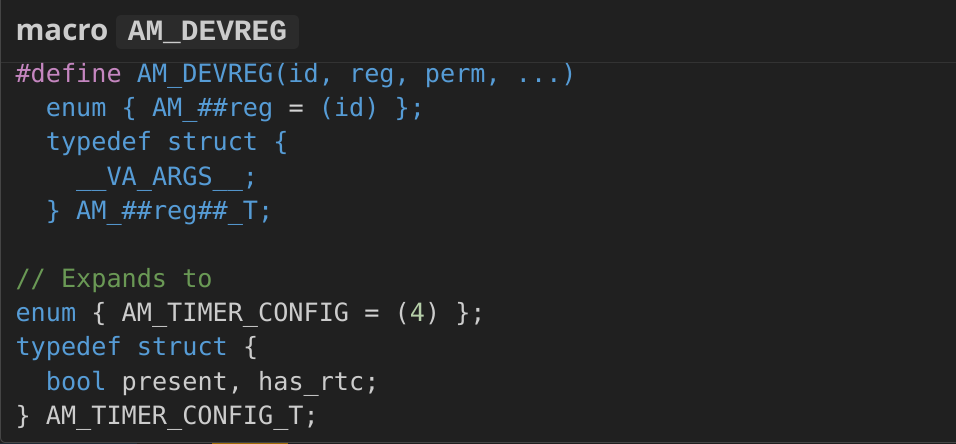
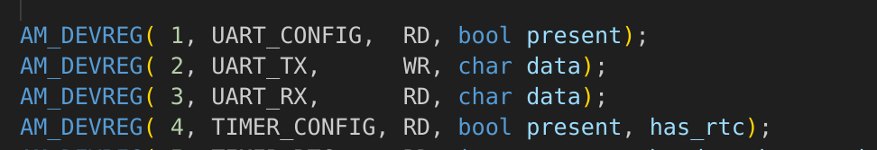
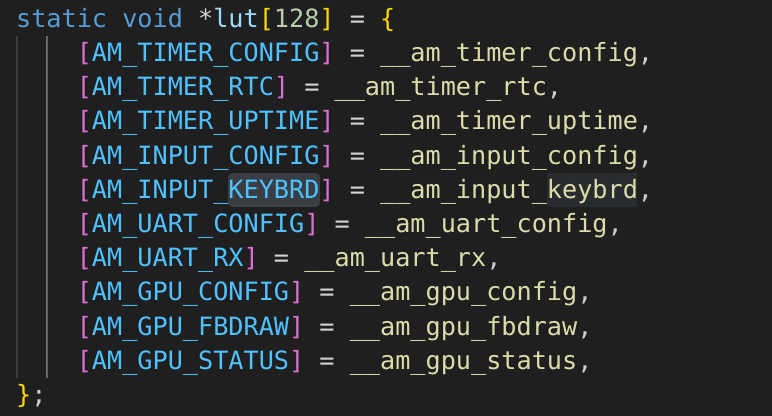
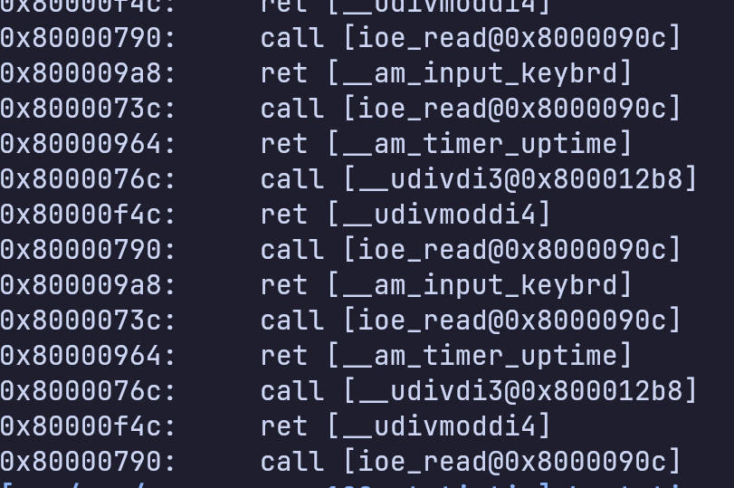
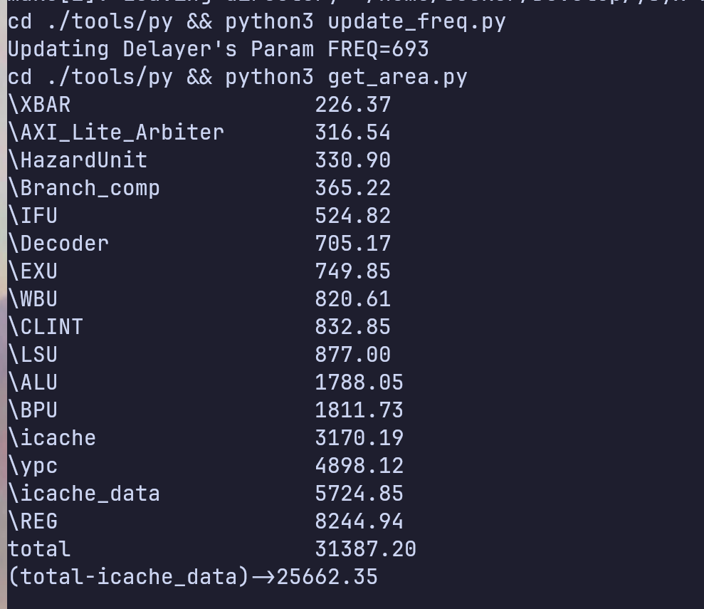

# <一生一芯> C阶段答辩

<br>
<br>
<br>
<br>
<br>

###### 23060325

###### 郭明轩

###### 东华理工大学


<style scoped>
img[alt*='#logo'] {
    position: absolute;
    bottom: 40px;
    right: 40px;
    width: 40%; /* 调整图片宽度 */
}
</style>

---
## 目录

- 项目架构图
- Makefiles
- NPC架构图
- typing-game
- BUG
- plan

---
#### 项目架构图



---

#### Makefiles-Overview



---

#### Makefiles

##### AMs

- $(AM_HOME)/Makefile
- $(AM_HOME)/scripts/riscv[.\*]-[.\*].mk
- $(AM_HOME)/scripts/isa/riscv.mk
- $(AM_HOME)/scripts/platform/["nemu","npc","soc"].mk

---

##### Makefile-AM(1)

###### Stage1-初始化和检查

AM_HOME,ARCH,etc

###### Stage2-获取编译/链接对象

创建build-dir 为编译/链接对象赋值
立即展开(:=)和延迟展开(=)

```makefile
### Collect the files to be linked: object files (`.o`) and libraries (`.a`)
OBJS      = $(addprefix $(DST_DIR)/, $(addsuffix .o, $(basename $(SRCS))))
LIBS     := $(sort $(LIBS) am klib) # lazy evaluation ("=") causes infinite recursions
```

---

##### Makefile-AM(2)

###### Stage3-生成编译参数

ISA,ARCH,PLATFORM等参数在这里以宏定义形式传递给编译器(曾经导致我的LSP问题)

```makefile
CFLAGS   += -g -O2 -MMD -Wall -Werror $(INCFLAGS) \
            -D__ISA__=\"$(ISA)\" -D__ISA_$(shell echo $(ISA) | tr a-z A-Z)__ \
            -D__ARCH__=$(ARCH) -D__ARCH_$(shell echo $(ARCH) | tr a-z A-Z | tr - _) \
            -D__PLATFORM__=$(PLATFORM) -D__PLATFORM_$(shell echo $(PLATFORM) | tr a-z A-Z | tr - _) \
            -DARCH_H=\"$(ARCH_H)\" \
            -fno-asynchronous-unwind-tables -fno-builtin -fno-stack-protector \
            -Wno-main -U_FORTIFY_SOURCE -fvisibility=hidden
```

---

##### Makefile-AM(3)

###### Stage4-include指定架构参数

include scripts/.mk

##### in scripts/.mk

- include riscv.mk - 主要是交叉编译器和编译参数
- include platform/npc.mk - AM_SRCS-am的源代码文件列表,链接脚本,还有image,run,gdb的target

---

##### Makefile-AM(4)

###### Stage5-编译链接规则

recursive make--for am,klib...

<!-- ## TODO: Why Rec-Make -->

```makefile
### Rule (recursive make): build a dependent library (am, klib, ...)
$(LIBS): %:
 @$(MAKE) -s -C $(AM_HOME)/$* archive
```

---

##### Makefile-AM(5)

###### Stage5-编译链接规则.1

自动依赖

```makefile
### Rule (`#include` dependencies): paste in `.d` files generated by gcc on `-MMD`
-include $(addprefix $(DST_DIR)/, $(addsuffix .d, $(basename $(SRCS))))
```

```makefile
/home/seeker/Develop/ysyx-workbench/am-kernels/kernels/typing-game/build/riscv32e-nemu/game.o: \
 /home/seeker/Develop/ysyx-workbench/am-kernels/kernels/typing-game/game.c \
 /home/seeker/Develop/ysyx-workbench/abstract-machine/am/include/am.h \
 /home/seeker/Develop/ysyx-workbench/abstract-machine/am/include/arch/riscv.h \
 /home/seeker/Develop/ysyx-workbench/abstract-machine/am/include/amdev.h \
 /home/seeker/Develop/ysyx-workbench/abstract-machine/klib/include/klib.h \
 /home/seeker/Develop/ysyx-workbench/abstract-machine/klib/include/klib-macros.h
```

<!-- ```
$(DST_DIR)/%.o: %.c
 @mkdir -p $(dir $@) && echo + CC $<
 @$(CC) -std=gnu11 $(CFLAGS) -c -o $@ $(realpath $<)
``` -->

<!-- ## TODO: .PHONY  -->

---

#### NPC微架构



<style scoped>
img[alt*='#right'] {
  width: 75%;
  float: right;
  position: absolute;
  right: 0; top: 0;
}
</style>
---

#### 解析typing-game

感觉程序本省没什么好说的,就讲一下与AM的交互吧

```text
Programs
######## <--
AM    #
######## <--
NPC/NEMU
```

---

##### AM-REGS

AM_TIMER_CONFIG,AM_INPUT_CONFIG,AM_TIMER_UPTIME,AM_GPU_FBDRAW
这些"抽象寄存器"实际上是一个存放了对应函数指针的跳转表,函数反回值是对应的寄存器的struct
其实使用gdb调试/clangd宏展开能很容易明白

<!-- 
 -->



---

#### 如何使用工具来帮助理解typing-game

~~其实AM的设计并不是很复杂，直接RTFM+GPT就好了~~
当然运用合理的工具还是能够加速的
gdb
~~编译器宏展开~~clangd宏展开
ftrace




---

#### 当时 ~~映像深刻~~ 有点搞笑 的BUG

stack overflow(UB)

- 在实现klib中的printf的时候直接在栈上开了100000个char
- 其他测试正常，跑microbench发现nemu报未实现一个C-Extension指令，一开始没意识到是爆栈了
- 发现编译出来的指令不是这个
- 查mtrace-发现写入了这块内存
- 继续查itrace-调试
- 发现sp(栈指针)一直增长
- 发现是klib的实现有问题

---

#### 其他工具的使用

- nix包管理器
- python脚本update-freq,get-area
<!-- - 还有今天的这个pre -->


---

#### Short-Term Plans

- PA
- NJU OS-Lab/xv6
- ~~用AM整点活~~

---

<!-- # THANKS -->

# 请各位助教老师批评指正


<style scoped>
img[alt*='#logo'] {
    position: absolute;
    bottom: 40px;
    right: 40px;
    width: 40%; /* 调整图片宽度 */
}
</style>
